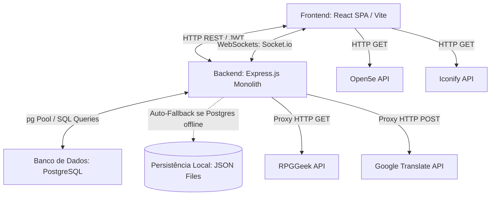

# ⚔️ RPGConnect — O Portal Definitivo do Aventureiro

O **RPGConnect** é uma plataforma web completa e imersiva desenvolvida para jogadores de RPG de mesa (Tabletop RPG) e entusiastas de board games. O sistema permite a exploração de locais físicos para encontros de comunidades, a formação de grupos, chat interativo em tempo real e um sistema dinâmico de progresso com fichas de personagens (XP/Nível).

---

## 🏗️ Descrição Técnica e Arquitetura

O projeto adota uma arquitetura **Cliente-Servidor (Client-Server)** desacoplada, utilizando comunicação baseada em requisições assíncronas HTTP (REST API) e conexões bidirecionais persistentes via WebSockets.



### Componentes Principais da Arquitetura:

1. **Frontend (Cliente SPA):** 
   Desenvolvido em **React.js** com empacotamento rápido via **Vite**. A interface consome dados dinâmicos das APIs locais e externas para renderizar mapas interativos (Leaflet), dashboards de perfil e salas de conversa em tempo real.
2. **Backend (Servidor Monolítico):** 
   Construído em **Node.js** com o framework **Express**. Gerencia as regras de negócio, centraliza endpoints de utilidades, expõe proxies de APIs externas para contornar problemas de CORS/segurança e orquestra o tráfego WebSocket.
3. **Comunicação em Tempo Real (WebSockets):**
   Implementada com **Socket.io** no backend e **socket.io-client** no frontend, permitindo entrega instantânea de mensagens privadas, alertas globais e indicadores visuais de digitação ("Usuário digitando...").
4. **Camada de Persistência Híbrida (PostgreSQL + JSON Fallback):**
   * **Banco de Dados Oficial:** Banco de dados **PostgreSQL** para armazenar usuários cadastrados e mensagens trocadas.
   * **Fallback de Alta Disponibilidade:** O arquivo de configuração de banco de dados (`db.js`) implementa um mecanismo de contingência automático: caso a conexão com o PostgreSQL falhe (por exemplo, serviço desligado localmente ou credenciais erradas), o sistema redireciona silenciosamente todas as leituras e escritas para arquivos de armazenamento local em formato estruturado JSON (`usuarios.json` e `mensagens.json`). Isso garante que a aplicação continue rodando perfeitamente em qualquer ambiente.

---

## 🛠️ Ferramentas e Tecnologias Utilizadas

### 💻 Frontend
* **React.js (v18):** Biblioteca base para construção das interfaces reativas baseadas em componentes.
* **Vite:** Ferramenta de build e servidor de desenvolvimento ultra-rápido.
* **React Router DOM:** Gerenciamento do roteamento no lado do cliente.
* **Leaflet & React-Leaflet:** Motor de renderização e interatividade para mapas digitais.
* **Socket.io Client:** Cliente WebSockets para comunicação síncrona.
* **Bootstrap (v5) & Vanilla CSS:** Combinação de grade responsiva com estilização detalhada customizada sob o tema *Arcane Dark* (roxos profundos, dourados e efeitos de *Glassmorphism*).

### ⚙️ Backend
* **Node.js:** Ambiente de execução Javascript no servidor.
* **Express.js:** Framework minimalista para criação de rotas REST.
* **Socket.io:** Servidor WebSockets para controle de conexões de usuários em tempo real.
* **pg (node-postgres):** Pool de conexões assíncronas para o PostgreSQL.
* **JSON Web Token (JWT):** Geração e validação de tokens de segurança para rotas autenticadas.
* **Crypto (nativo do Node):** Hashing seguro SHA-256 para armazenamento criptografado de senhas dos usuários.
* **Dotenv:** Gerenciador de variáveis de ambiente.

---

## 🚀 APIs & Sistemas Internos Integrados

O RPGConnect unifica diversos microssistemas utilitários e APIs públicas externas para enriquecer a experiência do jogador:

1. **Proxy RPGGeek API (`/api/rpggeek/search`):** 
   Realiza buscas de títulos de RPG de mesa e board games diretamente na plataforma pública do RPGGeek. O backend realiza o scraping e a limpeza do HTML original do site e retorna um JSON estruturado ao frontend (incluindo imagens, ID, título e ano de lançamento). O usuário utiliza essa busca para adicionar itens à sua lista de jogos favoritos.
2. **Proxy Google Translate API (`/usuarios/traduzir`):** 
   Endpoint intermediário no backend que se comunica com a API de tradução livre do Google. Permite que o frontend traduza termos e descrições técnicas de RPG recebidos em inglês para português de forma transparente e rápida.
3. **Integração Open5e API:** 
   O painel de usuário se conecta à API aberta de D&D 5e (`https://api.open5e.com/v1/classes/`) para sortear e carregar dinamicamente características das classes de personagens (como habilidades de Mago, Bárbaro, etc.). Caso o serviço externo esteja offline, o sistema ativa um **banco local de fallback** contendo todas as classes clássicas pré-configuradas em português.
4. **Integração Iconify API:** 
   Renderiza imagens vetoriais (SVG) dinamicamente com base nas classes do usuário utilizando o catálogo especializado `game-icons` do Iconify, eliminando a necessidade de carregar imagens locais pesadas.
5. **Dado Rolador (Dice Roller - `/rolar/:lados`):** 
   Um sistema que calcula resultados pseudo-aleatórios para dados de RPG (`d4`, `d6`, `d8`, `d10`, `d12`, `d20`, `d100`). Retorna mensagens temáticas especiais para rolagens críticas (como 1 ou 20 em um `d20`). O chat da Taberna possui atalhos para os dados e injeta os resultados diretamente nas mensagens.
6. **Gerador de Fobias de Monstros (`/fobia-monstro`):** 
   Sistema que sorteia fraquezas ou fobias aleatórias para encontros temáticos contra monstros (ex: "Luz Forte", "Fogo", "Alho").
7. **Gerador de Nomes de Tribos/Hordas (`/tribo`):** 
   Algoritmo no backend que combina substantivos, adjetivos e termos medievais para gerar hordas inimigas exclusivas respeitando concordância de gênero da língua portuguesa (ex: "Clã da Caveira Cinzenta", "Horda do Fogo Vermelho").
8. **Dica de RPG do Dia (`/dica`):** 
   Fornece conselhos e diretrizes dinâmicas de RPG (para mestres e jogadores) exibidas no dashboard principal do usuário.
9. **Uptime & Status Monitoring (`/status`):** 
   Audita e fornece a integridade de funcionamento dos módulos internos, abastecendo as pílulas de status na interface visual.
10. **Gerenciador de Experiência (XP):** 
    Sistema interno no frontend que computa pontos de experiência para o usuário após interações chaves (cadastrar jogos favoritos, enviar mensagens no chat, login diário), calculando o nível dinamicamente de acordo com uma progressão matemática.

---

## 🔌 Definição dos Endpoints e Fluxos de Integração

### 1. Rotas REST (HTTP - Backend)

| Método | Endpoint | Autenticação | Descrição |
| :--- | :--- | :--- | :--- |
| **POST** | `/usuarios/cadastro` | Livre | Registra novo usuário, criptografa a senha em SHA-256, retorna os dados e o Token JWT correspondente. |
| **POST** | `/usuarios/login` | Livre | Autentica o usuário, validando credenciais. Retorna informações básicas e o Token JWT. |
| **GET** | `/usuarios/usuarios-online` | Requer JWT | Retorna a lista de usuários cadastrados no sistema com a prévia e data da última mensagem trocada com o remetente. |
| **GET** | `/usuarios/historico/:meuId/:outroId` | Requer JWT | Busca e lista as mensagens arquivadas trocadas entre os dois usuários informados nos parâmetros da URL. |
| **PUT** | `/usuarios/perfil-update` | Requer JWT | Sincroniza e atualiza os dados do perfil (nome, biografia, grimório e avatar em formato Base64). |
| **GET** | `/usuarios/:id` | Livre | Retorna dados públicos detalhados do perfil de um jogador. |
| **POST** | `/usuarios/traduzir` | Requer JWT | Proxy seguro que recebe um texto em inglês e retorna a tradução em português via Google Translate API. |
| **GET** | `/dica` | Livre | Retorna uma dica de mestre aleatória para compor o painel do usuário. |
| **GET** | `/status` | Livre | Retorna o status ("Online" / "Offline") dos componentes da aplicação. |
| **GET** | `/info-classe?classe={nome}` | Livre | Retorna a descrição detalhada e o propósito da classe passada como parâmetro. |
| **GET** | `/fobia-monstro` | Livre | Gera e retorna uma fraqueza aleatória para montagem de monstros RPG. |
| **GET** | `/tribo` | Livre | Gera um nome de facção ou horda inimiga aleatória. |
| **GET** | `/rolar/:lados` | Livre | Rola um dado virtual correspondente ao número de lados e retorna o número obtido e frases personalizadas. |
| **GET** | `/api/rpggeek/search?q={termo}` | Livre | Consulta e faz parsing de dados do catálogo RPGGeek para busca de jogos favoritos. |
| **GET** | `/health` | Livre | Endpoint de checagem básica de integridade do servidor. |

> [!NOTE]
> Para rotas que requerem autenticação, o token deve ser fornecido nos cabeçalhos HTTP no formato:
> `Authorization: Bearer <seu_token_jwt>`

### 2. Eventos WebSocket (Socket.io)

| Evento | Origem | Payload | Descrição |
| :--- | :--- | :--- | :--- |
| `join` | Cliente | `userId` | Associa o socket do cliente a uma sala privada correspondente ao ID dele para escuta isolada de mensagens. |
| `enviar_mensagem` | Cliente | `{ remetenteId, destinatarioId, conteudo, timestamp }` | Envia uma nova mensagem privada. O backend salva a mensagem no banco e repassa para a sala do destinatário. |
| `receber_mensagem` | Servidor | `{ remetenteId, destinatarioId, conteudo, timestamp }` | Dispara a mensagem recebida para o cliente de destino atualizar o chat instantaneamente. |
| `digitando` | Cliente | `{ remetenteId, destinatarioId }` | Informa que o remetente começou a digitar no campo de texto. |
| `usuario_digitando` | Servidor | `remetenteId` | Emite o aviso ao destinatário correspondente para renderizar o indicador de digitação de forma visual. |
| `parou_digitar` | Cliente | `{ remetenteId, destinatarioId }` | Avisa que o remetente limpou ou parou de interagir com o campo de digitação. |
| `usuario_parou_digitar` | Servidor | `remetenteId` | Apaga o indicador de digitação na tela do destinatário correspondente. |
| `novo_usuario` | Servidor | `{ id, nome }` | Emitido globalmente para que os usuários ativos atualizem a lista de aventureiros online sem recarregar a tela. |

---

## 🏁 Como Executar e Implantar

### Pré-requisitos
* **Node.js** (versão 16.x ou superior recomendada)
* **PostgreSQL** (versão 12.x ou superior) - *Opcional, devido ao JSON Fallback integrado.*

### 📂 Estrutura de Pastas Útil
```
Projeto Integração/
└── RpgConnect/
    ├── backend/
    │   ├── src/
    │   │   ├── config/ (db.js)
    │   │   ├── middleware/ (authMiddleware.js)
    │   │   └── routes/ (usuarioRoutes.js)
    │   ├── app.js
    │   └── migrate.js
    ├── src/
    │   ├── components/ (dashboard.jsx, Chat.jsx, Perfil.jsx, etc)
    │   └── App.tsx
    └── package.json
```

### 1. Configuração do Ambiente do Backend
Crie um arquivo `.env` dentro da pasta `backend/` seguindo o modelo abaixo:
```env
DB_HOST=localhost
DB_USER=seu_usuario_postgres
DB_PASSWORD=sua_senha_postgres
DB_NAME=RPG
DB_PORT=5432
JWT_SECRET=sua_chave_secreta_jwt
```

### 2. Instalação e Execução dos Serviços

Execute os comandos a seguir em dois terminais separados a partir da raiz da pasta do projeto (`RpgConnect/`):

#### Terminal 1: Servidor Backend
```bash
# Navegar até o diretório do backend
cd backend

# Instalar dependências do servidor
npm install

# (Opcional) Executar a migração para criar as tabelas no PostgreSQL
node migrate.js

# Iniciar o servidor backend em modo de desenvolvimento (Porta 8080)
npm run dev
```

#### Terminal 2: Aplicação Frontend
```bash
# Instalar dependências do frontend (na raiz do RpgConnect)
npm install

# Iniciar o servidor Vite (Porta 5173 por padrão)
npm run dev
```

Abra seu navegador e acesse o endereço fornecido pelo console do Vite (usualmente `http://localhost:5173`).

---

## ℹ️ Informações Adicionais para Avaliação

* **Autenticação com JWT:** Todas as rotas sensíveis do sistema validam a presença do token JWT no formato `Bearer`. A expiração padrão do token é configurada em **24 horas**.
* **Resiliência da Base de Dados:** O sistema foi projetado para tolerar falhas. Se o banco PostgreSQL ficar indisponível a qualquer momento, a camada `db.js` intercepta a consulta SQL correspondente e mapeia a lógica de escrita/leitura nos arquivos JSON locais, garantindo que o avaliador consiga testar o sistema localmente mesmo sem um servidor Postgres rodando.
* **Fallback da API Open5e:** Caso a API externa de D&D saia do ar ou sofra com lentidão/bloqueio de IP, o painel recupera instantaneamente as fichas a partir do arquivo local estático `LOCAL_CLASSES`.
* **Criptografia de Senhas:** O banco de dados nunca salva senhas em texto puro. O sistema computa o hash criptográfico **SHA-256** das senhas, o que previne roubo de credenciais em caso de brechas de segurança.
* **Persistência de Sessão e Cache Local:** O frontend faz uso estratégico do `localStorage` para reter o token, os dados do usuário conectado, o histórico do chat de conversas (reduzindo requisições redundantes ao backend) e a classe de RPG escolhida, combinando-os com chamadas à API em tempo real para sincronização.

---
*⚔️ RPGConnect — Criado por aventureiros para aventureiros.*
